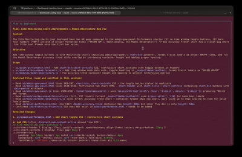

# Claude Code SDLC Enforcement

A hook-based system that mechanically enforces software development discipline in Claude Code sessions. Instead of relying on instructions that the model can ignore, this uses Claude Code's hook system to **block tool execution** when the model tries to skip steps.

<p align="center">
  
</p>

## The Problem

Claude Code's helpfulness bias makes it skip exploration and write thin plans. Instruction files say "explore first, plan second" but the model routinely jumps straight to code. The result: changes that don't fit the codebase, duplicate functions, missed patterns.

## The Solution

Four enforcement layers, each backed by shell scripts that block tool execution when the model cuts corners:

### Layer 1: Plan Gate (Edit/Write Blocking)
**No code changes without an approved plan.** Every `Edit`, `Write`, and `NotebookEdit` call is intercepted by `require_plan_approval.sh`. If no approval markers exist, the tool is blocked with instructions telling the model exactly what to do.

### Layer 2: Exploration Tracking
**The model must actually read before it plans.** When `EnterPlanMode` fires, `clear_plan_on_new_task.sh` creates a planning marker and resets an exploration counter to zero. Every subsequent `Read`, `Glob`, or `Grep` call increments the counter via `track_exploration.sh`. This runs in <5ms and does nothing outside plan mode.

### Layer 3: Plan Quality Gate
**The plan must be substantive.** When the model calls `ExitPlanMode`, `validate_plan_quality.sh` runs as a PreToolUse hook and checks:

| Check | Requirement | Why |
|-------|-------------|-----|
| Exploration depth | >= 3 reads/searches | Forces the model to actually look at docs and code |
| Plan file exists | `.md` file in `~/.claude/plans/` or `.claude/plans/` | No plan = no approval |
| Plan freshness | < 30 minutes old | Prevents stale plans from prior sessions |
| Plan substance | >= 50 words | Blocks one-liner "plans" |
| File references | At least one file path | Plan must reference real files |
| Exploration evidence | Keywords like "existing", "found", "current" | Plan must describe what was discovered |
| Required sections | `## Objective` (10+ words), `## Scope` (file paths), `## Success Criteria` (10+ words), `## Justification` (cites project files + reasoning) | Enforces structured planning |
| Exploration cross-ref | Plan mentions >= 2 files from exploration log | Proves the plan builds on actual exploration, not assumptions |

If any check fails, `ExitPlanMode` is blocked and the model gets a specific error message telling it what's missing.

### Layer 4: Destructive Command Guard
**Dangerous shell commands are blocked when they'd discard work.** `guard_destructive_bash.sh` intercepts every `Bash` tool call and blocks `git checkout --`, `git reset --hard`, `git clean -f`, and `rm -rf` when they target uncommitted or git-tracked files. The model must ask the user for confirmation before proceeding.

## State Machine

```
[No Approval] ──EnterPlanMode──► [Planning] ──ExitPlanMode──► [Approved/Implementing]
      ^                               |                           |
      |                          (reads tracked,            (approval persists
      |                           counter increments)        across messages
      |                                                      AND sessions)
      |                                                           |
      └──── /accept, /reject, or EnterPlanMode ──────────────────┘
```

Approval is **persistent** — stored per project directory in `~/.claude/state/`. New sessions on the same project automatically inherit existing approval. Approval clears only when:

- **`/accept`** — user accepts the completed implementation (plugin command)
- **`/reject`** — user rejects; must re-plan (plugin command)
- **`EnterPlanMode`** — starting a new plan cycle clears the previous one

## File Reference

### Scripts (`scripts/`)

| Script | Hook | Purpose |
|--------|------|---------|
| `common.sh` | — | Shared library: state helpers, persistent state, session hydration |
| `require_plan_approval.sh` | PreToolUse: Edit\|Write\|NotebookEdit | Blocks code changes without approval markers |
| `validate_plan_quality.sh` | PreToolUse: ExitPlanMode | Quality gate — checks exploration + plan substance |
| `approve_plan.sh` | PostToolUse: ExitPlanMode | Creates approval markers (session + persistent) |
| `clear_plan_on_new_task.sh` | PostToolUse: EnterPlanMode | Clears old approval, starts exploration tracking |
| `track_exploration.sh` | PreToolUse: Read\|Glob\|Grep | Increments exploration counter during planning |
| `check_clear_approval_command.sh` | UserPromptSubmit | No-op — approval persists across messages |
| `guard_destructive_bash.sh` | PreToolUse: Bash | Guards against destructive shell commands |
| `accept_outcome.sh` | Via `/accept` command | Clears approval after user accepts implementation |
| `reject_outcome.sh` | Via `/reject` command | Clears approval after user rejects implementation |
| `restore_approval.sh` | Manual | Emergency escape hatch — restores persistent approval |
| `clear_approval.sh` | Manual | Force-clear approval markers |
| `cleanup_session.sh` | SessionEnd | Cleans up session state directory |
| `cleanup_stale_sessions.sh` | SessionStart | Removes session dirs older than 6 hours |
| `strip-claude-coauthor.sh` | Git hook | Removes "Co-Authored-By: Claude" from commit messages |

### Plugin (`plugins/plan-workflow/`)

| Command | Description |
|---------|-------------|
| `/accept` | Accept completed implementation, clear plan approval |
| `/reject` | Reject implementation, clear approval, request feedback |

### State Storage

| Location | Scope | Survives sessions? |
|----------|-------|--------------------|
| `/tmp/.claude_hooks/{session_id}/` | Session-specific (planning, explore_count) | No |
| `~/.claude/state/{project_hash}/` | Project-specific (approval, scope, criteria) | Yes |

On session start, `common.sh` hydrates session state from persistent state automatically.

### Git Hooks (`git-hooks/`)

Commit message hygiene and safety checks. Set globally via `git config --global core.hooksPath ~/.claude/git-hooks`.

### Configuration

| File | Purpose |
|------|---------|
| `CLAUDE.md` | Instructions loaded into every session — rules, plan requirements, state machine docs |
| `settings.json` | Hook wiring — maps tool events to enforcement scripts |

## Prerequisites

**Required:**
- **Bash** 3.0+ (ships with macOS; check with `bash --version`)
- **jq** — JSON processing (`brew install jq` / `apt install jq`)
- **Git** (for hooks and `git rev-parse` in scripts)
- **Claude Code CLI** installed and working ([install guide](https://docs.anthropic.com/en/docs/claude-code))

**Optional linting tools** (all degrade gracefully if missing):

| Tool | Used for | Install |
|------|----------|---------|
| `shellcheck` | Shell script analysis | `brew install shellcheck` / `apt install shellcheck` |
| `ruff` | Python linting | `pip install ruff` |
| `flake8` | Python linting (ruff fallback) | `pip install flake8` |
| `eslint` | JS/TS linting | `npm install -g eslint` |
| `gofmt` | Go formatting | Included with Go |
| `rustfmt` | Rust formatting | `rustup component add rustfmt` |
| `git-lfs` | Large file storage | `brew install git-lfs` / `apt install git-lfs` |

**Platform notes:**
- **macOS**: Works out of the box.
- **Linux**: `common.sh` includes cross-platform `file_mtime()` that handles both macOS and Linux `stat` syntax.

## Installation

### Step 1: Back up existing configuration

If you already have a `~/.claude` directory with your own settings:

```bash
cp ~/.claude/CLAUDE.md ~/.claude/CLAUDE.md.bak 2>/dev/null
cp ~/.claude/settings.json ~/.claude/settings.json.bak 2>/dev/null
```

### Step 2: Clone the template

```bash
git clone https://github.com/samudzi/claude-code-sdlc.git ~/.claude-sdlc
```

### Step 3: Copy files into `~/.claude`

```bash
# Core configuration
cp ~/.claude-sdlc/CLAUDE.md ~/.claude/CLAUDE.md
cp ~/.claude-sdlc/settings.json ~/.claude/settings.json

# Enforcement scripts
cp -r ~/.claude-sdlc/scripts/ ~/.claude/scripts/

# Plugin (provides /accept and /reject commands)
cp -r ~/.claude-sdlc/plugins/plan-workflow/ ~/.claude/plugins/plan-workflow/

# Git hooks (pre-commit linting, commit-msg hygiene)
cp -r ~/.claude-sdlc/git-hooks/ ~/.claude/git-hooks/
```

If you had existing `CLAUDE.md` content, merge your backed-up rules into the new file — the SDLC rules must remain intact for the hooks to work correctly.

### Step 4: Make scripts executable

```bash
chmod +x ~/.claude/scripts/*.sh ~/.claude/git-hooks/*
```

### Step 5: Create required directories

```bash
mkdir -p ~/.claude/plans ~/.claude/state
```

### Step 6: Set global git hooks path

```bash
git config --global core.hooksPath ~/.claude/git-hooks
```

This makes the pre-commit (linting + safety checks) and commit-msg (attribution stripping) hooks run in every repo. Repos with their own linting frameworks (`.pre-commit-config.yaml`, `.husky`, `lefthook.yml`, `lint-staged`) are automatically bypassed.

### Step 7: Verify the installation

```bash
# 1. Check all scripts are executable
ls -la ~/.claude/scripts/*.sh

# 2. Syntax-check every script
for f in ~/.claude/scripts/*.sh; do bash -n "$f" && echo "OK: $f"; done

# 3. Verify hooks are wired (9 hook scripts across 5 event types)
grep -c 'scripts/' ~/.claude/settings.json  # Should show 9

# 4. Verify plugin exists
cat ~/.claude/plugins/plan-workflow/.claude-plugin/plugin.json

# 5. Verify jq is installed
jq --version
```

## Per-Project vs Global Setup

### Global (default)

The files you installed apply to **every Claude Code session**:

- `~/.claude/CLAUDE.md` — loaded as instructions in every session
- `~/.claude/settings.json` — hooks fire on every tool call
- `~/.claude/plugins/plan-workflow/` — `/accept` and `/reject` commands available everywhere
- `~/.claude/git-hooks/` — run on every git commit (via `core.hooksPath`)

### Per-project overrides

Create a `CLAUDE.md` in any project root to add project-specific rules. Claude Code loads **both** the global `~/.claude/CLAUDE.md` and the project's `CLAUDE.md`:

```bash
cat > ~/my-project/CLAUDE.md << 'EOF'
# Project Instructions

- Before modifying code, review `docs/architecture.md`
- Run `npm test` after any changes to `src/`
- Never modify files in `vendor/`
EOF
```

### Per-project git hooks

If a specific repo needs its own pre-commit hook **instead of** the global one, create `.git/hooks/pre-commit` in that repo. The global hook detects legitimate local hooks and chains to them automatically. Repos using framework-managed hooks (`.pre-commit-config.yaml`, `.husky`, `lefthook.yml`, `lint-staged`) are bypassed entirely.

## Customization

**Adjust exploration minimum:** Change the threshold in `validate_plan_quality.sh`.

**Adjust plan word minimum:** Change the word count check in `validate_plan_quality.sh`.

**Adjust plan staleness window:** Change the minutes threshold in `validate_plan_quality.sh`.

**Add project-specific rules:** Create `<project>/CLAUDE.md` with project-specific instructions. These load alongside the global `~/.claude/CLAUDE.md`.

**Disable specific git hooks:** Remove or rename individual files in `~/.claude/git-hooks/`.

## Escape Hatches

If the enforcement is blocking legitimate work:

```bash
# Restore approval for the current project (persists across sessions)
~/.claude/scripts/restore_approval.sh

# Or clear approval to force re-planning
~/.claude/scripts/clear_approval.sh
```

The system is designed so that a competent model doing its job properly never hits the gates — they only fire when it tries to shortcut.

## Further Reading

- **[USER_GUIDE.md](USER_GUIDE.md)** — When to use this, workflow examples, tips for AI/startup engineering
- **[CLAUDE.md](CLAUDE.md)** — The instruction set loaded into Claude's context
